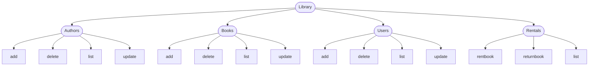
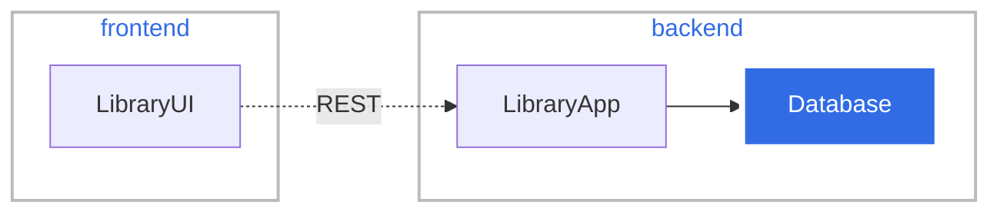

#Functionality

#Deployment view

#Tutorials
https://spring.io/guides/gs/accessing-data-mysql/

https://www.javaguides.net/2020/07/react-js-crud-application-example.html

# User Stories
| No  | Title                                          | Description                                                                                                                                                                                                                                      |
|-----|------------------------------------------------|--------------------------------------------------------------------------------------------------------------------------------------------------------------------------------------------------------------------------------------------------|
| 1   | As a User I want to list all authors via REST  | CoS:<ul><li>there is GET endpoint /authors/</li><li>ednpoints returns json with list of all authors in DB</li><li>all fields of authors are visible in output and id</li></ul>                                                                   |
| 2   | As a User I want to add author via REST        | CoS:<ul><li>there is POST endpoint /authors</li><li>author is added to database</li><li>posting the same autor once again duplicate entry</li><li>following fields are needed: name, lastname</li><li>mandatory fields: name, lastname</li></ul> |
| 3   | As a User I want to edit author via REST       | CoS:<ul><li>there is PATCH endpoint /authors/{id}</li><li>author is update in database</li><li>only fields specified in the request are updated</li></ul>                                                                                        |
| 4   | As a User I want to add delete author via REST | CoS:<ul><li>there is DELETE endpoint /authors/{id}</li><li>author is deleted from database</li><li>when autor with given id is not present 204 error is returned</li></ul>                                                                       |

